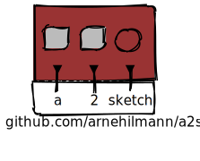

# a2sketch

convert asciiart to handwritten sketches



<sub>

         #-------------------.
         |[0]                |
         | .---# .---# #---. |
         | |[1]| |[1]| |[2]| |
         | #---' #---' '---# |
         |   ^     ^     ^   |
         #---+-----+--=--+---#
         |   |     |     |   |
         |   a     2  sketch |
         '-------------------#
      github.com/arnehilmann/a2sketch

    [0]: {"fill": "#933", "a2s:delref": true, "fillStyle": "solid"}
    [1]: {"fill": "#bbb", "a2s:delref": true, "fillStyle": "solid"}
    [2]: {"fill": "#bbb", "a2s:delref": true, "fillStyle": "solid", "a2s:type": "circle"}
</sub>

## tl;dr

```
docker pull arne/a2sketch:0.11
docker run -it -p 22357:22357 arne/a2sketch:0.11
curl -s --data-binary "-=-=- tadahh -==-" http://localhost:22753/a2sketch -o sketch.svg
open sketch.svg
```


## documentation

see the original
[How Do I Draw Section](https://github.com/dhobsd/asciitosvg#how-do-i-draw)


## your own shapes

In `a2s-custom-types`, you can define your own shapes:

1. the filename must be the name of your shape with ".path" extension<br/>
   example: shape "drop" -> `a2s-custom-types/drop.path`

2. the file must contain a single path element, with the attributes `width`, `height`, and `d`<br/>
   example: `<path width="100" height="100" d="M 50 0 A 50 50 0 1 0 100 50 V 0 Z" />`

Notes: review the [Creating Special Objects Section](https://github.com/dhobsd/asciitosvg#creating-special-objects)
and have a look at some svg path documentation, like the
[SVG Path Tutorial](https://developer.mozilla.org/en-US/docs/Web/SVG/Tutorial/Paths).


## References

[@docker-hub](https://hub.docker.com/r/arne/a2sketch/)


## Credits

* [asciitosvg](https://github.com/dhobsd/asciitosvg):
  Converting asciiart to crisp svg

* [rough.js](https://github.com/pshihn/rough):
  Simulating shaky handwriting


## License

[MIT License](LICENSE) © [Arne Hilmann](https://github.com/arnehilmann)
